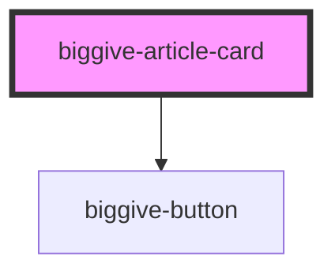

# biggive-basic-card

<!-- Auto Generated Below -->

## Properties

| Property               | Attribute                 | Description | Type                                                                                                                                                                                                                                                                                                                                                                                                                                                                                                                                                                                                                                                                                       | Default     |
| ---------------------- | ------------------------- | ----------- | ------------------------------------------------------------------------------------------------------------------------------------------------------------------------------------------------------------------------------------------------------------------------------------------------------------------------------------------------------------------------------------------------------------------------------------------------------------------------------------------------------------------------------------------------------------------------------------------------------------------------------------------------------------------------------------------ | ----------- |
| `backgroundColour`     | `background-colour`       |             | `"primary" \| "secondary" \| "tertiary" \| "white" \| "black" \| "clear-primary" \| "clear-secondary" \| "clear-tertiary" \| "clear-white" \| "clear-black" \| "brand-cc-red" \| "brand-wgmf-purple" \| "brand-gmf-green" \| "brand-er-green" \| "brand-er-blue" \| "brand-er-teal" \| "brand-er-dark-green" \| "brand-emf-yellow" \| "brand-c4c-orange" \| "brand-afa-pink" \| "brand-scw-magenta" \| "brand-grey" \| "brand-mhf-turquoise" \| "grey-extra-light" \| "grey-light" \| "grey-medium" \| "grey-dark" \| "philco-orange" \| "philco-gray-90" \| "philco-gray-70" \| "philco-white" \| "philco-success-green" \| "philco-error-coral" \| "philco-gray-30" \| "philco-gray-20"` | `'white'`   |
| `backgroundImageUrl`   | `background-image-url`    |             | `string`                                                                                                                                                                                                                                                                                                                                                                                                                                                                                                                                                                                                                                                                                   | `''`        |
| `buttonColour`         | `button-colour`           |             | `"primary" \| "secondary" \| "tertiary" \| "white" \| "black" \| "clear-primary" \| "clear-secondary" \| "clear-tertiary" \| "clear-white" \| "clear-black" \| "brand-cc-red" \| "brand-wgmf-purple" \| "brand-gmf-green" \| "brand-er-green" \| "brand-er-blue" \| "brand-er-teal" \| "brand-er-dark-green" \| "brand-emf-yellow" \| "brand-c4c-orange" \| "brand-afa-pink" \| "brand-scw-magenta" \| "brand-grey" \| "brand-mhf-turquoise" \| "grey-extra-light" \| "grey-light" \| "grey-medium" \| "grey-dark" \| "philco-orange" \| "philco-gray-90" \| "philco-gray-70" \| "philco-white" \| "philco-success-green" \| "philco-error-coral" \| "philco-gray-30" \| "philco-gray-20"` | `'black'`   |
| `buttonLabel`          | `button-label`            |             | `string`                                                                                                                                                                                                                                                                                                                                                                                                                                                                                                                                                                                                                                                                                   | `undefined` |
| `buttonUrl`            | `button-url`              |             | `string`                                                                                                                                                                                                                                                                                                                                                                                                                                                                                                                                                                                                                                                                                   | `undefined` |
| `clipBottomLeftCorner` | `clip-bottom-left-corner` |             | `boolean`                                                                                                                                                                                                                                                                                                                                                                                                                                                                                                                                                                                                                                                                                  | `true`      |
| `clipTopRightCorner`   | `clip-top-right-corner`   |             | `boolean`                                                                                                                                                                                                                                                                                                                                                                                                                                                                                                                                                                                                                                                                                  | `true`      |
| `date`                 | `date`                    |             | `string`                                                                                                                                                                                                                                                                                                                                                                                                                                                                                                                                                                                                                                                                                   | `undefined` |
| `dateColour`           | `date-colour`             |             | `"primary" \| "secondary" \| "tertiary" \| "white" \| "black" \| "clear-primary" \| "clear-secondary" \| "clear-tertiary" \| "clear-white" \| "clear-black" \| "brand-cc-red" \| "brand-wgmf-purple" \| "brand-gmf-green" \| "brand-er-green" \| "brand-er-blue" \| "brand-er-teal" \| "brand-er-dark-green" \| "brand-emf-yellow" \| "brand-c4c-orange" \| "brand-afa-pink" \| "brand-scw-magenta" \| "brand-grey" \| "brand-mhf-turquoise" \| "grey-extra-light" \| "grey-light" \| "grey-medium" \| "grey-dark" \| "philco-orange" \| "philco-gray-90" \| "philco-gray-70" \| "philco-white" \| "philco-success-green" \| "philco-error-coral" \| "philco-gray-30" \| "philco-gray-20"` | `'black'`   |
| `image1AltText`        | `image-1-alt-text`        |             | `string`                                                                                                                                                                                                                                                                                                                                                                                                                                                                                                                                                                                                                                                                                   | `undefined` |
| `image1Url`            | `image-1-url`             |             | `string`                                                                                                                                                                                                                                                                                                                                                                                                                                                                                                                                                                                                                                                                                   | `undefined` |
| `image2AltText`        | `image-2-alt-text`        |             | `string`                                                                                                                                                                                                                                                                                                                                                                                                                                                                                                                                                                                                                                                                                   | `undefined` |
| `image2Url`            | `image-2-url`             |             | `string`                                                                                                                                                                                                                                                                                                                                                                                                                                                                                                                                                                                                                                                                                   | `undefined` |
| `imageLabel`           | `image-label`             |             | `string`                                                                                                                                                                                                                                                                                                                                                                                                                                                                                                                                                                                                                                                                                   | `undefined` |
| `imageLabelColour`     | `image-label-colour`      |             | `"primary" \| "secondary" \| "tertiary" \| "white" \| "black" \| "clear-primary" \| "clear-secondary" \| "clear-tertiary" \| "clear-white" \| "clear-black" \| "brand-cc-red" \| "brand-wgmf-purple" \| "brand-gmf-green" \| "brand-er-green" \| "brand-er-blue" \| "brand-er-teal" \| "brand-er-dark-green" \| "brand-emf-yellow" \| "brand-c4c-orange" \| "brand-afa-pink" \| "brand-scw-magenta" \| "brand-grey" \| "brand-mhf-turquoise" \| "grey-extra-light" \| "grey-light" \| "grey-medium" \| "grey-dark" \| "philco-orange" \| "philco-gray-90" \| "philco-gray-70" \| "philco-white" \| "philco-success-green" \| "philco-error-coral" \| "philco-gray-30" \| "philco-gray-20"` | `'black'`   |
| `mainImageAltText`     | `main-image-alt-text`     |             | `string`                                                                                                                                                                                                                                                                                                                                                                                                                                                                                                                                                                                                                                                                                   | `undefined` |
| `mainImageUrl`         | `main-image-url`          |             | `string`                                                                                                                                                                                                                                                                                                                                                                                                                                                                                                                                                                                                                                                                                   | `undefined` |
| `mainTitle`            | `main-title`              |             | `string`                                                                                                                                                                                                                                                                                                                                                                                                                                                                                                                                                                                                                                                                                   | `undefined` |
| `mainTitleColour`      | `main-title-colour`       |             | `"primary" \| "secondary" \| "tertiary" \| "white" \| "black" \| "clear-primary" \| "clear-secondary" \| "clear-tertiary" \| "clear-white" \| "clear-black" \| "brand-cc-red" \| "brand-wgmf-purple" \| "brand-gmf-green" \| "brand-er-green" \| "brand-er-blue" \| "brand-er-teal" \| "brand-er-dark-green" \| "brand-emf-yellow" \| "brand-c4c-orange" \| "brand-afa-pink" \| "brand-scw-magenta" \| "brand-grey" \| "brand-mhf-turquoise" \| "grey-extra-light" \| "grey-light" \| "grey-medium" \| "grey-dark" \| "philco-orange" \| "philco-gray-90" \| "philco-gray-70" \| "philco-white" \| "philco-success-green" \| "philco-error-coral" \| "philco-gray-30" \| "philco-gray-20"` | `'black'`   |
| `slug`                 | `slug`                    |             | `string`                                                                                                                                                                                                                                                                                                                                                                                                                                                                                                                                                                                                                                                                                   | `undefined` |
| `slugColour`           | `slug-colour`             |             | `"primary" \| "secondary" \| "tertiary" \| "white" \| "black" \| "clear-primary" \| "clear-secondary" \| "clear-tertiary" \| "clear-white" \| "clear-black" \| "brand-cc-red" \| "brand-wgmf-purple" \| "brand-gmf-green" \| "brand-er-green" \| "brand-er-blue" \| "brand-er-teal" \| "brand-er-dark-green" \| "brand-emf-yellow" \| "brand-c4c-orange" \| "brand-afa-pink" \| "brand-scw-magenta" \| "brand-grey" \| "brand-mhf-turquoise" \| "grey-extra-light" \| "grey-light" \| "grey-medium" \| "grey-dark" \| "philco-orange" \| "philco-gray-90" \| "philco-gray-70" \| "philco-white" \| "philco-success-green" \| "philco-error-coral" \| "philco-gray-30" \| "philco-gray-20"` | `'black'`   |
| `spaceBelow`           | `space-below`             |             | `0 \| 1 \| 2 \| 3 \| 4 \| 5 \| 6`                                                                                                                                                                                                                                                                                                                                                                                                                                                                                                                                                                                                                                                          | `0`         |

## Dependencies

### Depends on

- [biggive-button](../biggive-button)

### Graph

----------------------------------------------

*Built with [StencilJS](https://stenciljs.com/)*
