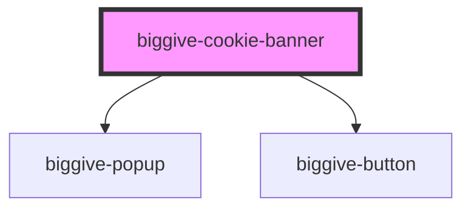

# biggive-cookie-banner

For now this just displays a banner with buttons that do nothing. Once we're happy with how it looks we'll move on
to making it work before we can add it to our website.

<!-- Auto Generated Below -->

## Properties

| Property                            | Attribute               | Description                                                                                                                                                                                                                                                                                                                                                                                                                            | Type                                                                  | Default     |
| ----------------------------------- | ----------------------- | -------------------------------------------------------------------------------------------------------------------------------------------------------------------------------------------------------------------------------------------------------------------------------------------------------------------------------------------------------------------------------------------------------------------------------------- | --------------------------------------------------------------------- | ----------- |
| `autoOpenPreferences`               | `auto-open-preferences` | If true the Preferences modal will be auto-opened - for use when the user has requested to edit their cookie preferences                                                                                                                                                                                                                                                                                                               | `boolean`                                                             | `false`     |
| `blogUriPrefix` _(required)_        | `blog-uri-prefix`       |                                                                                                                                                                                                                                                                                                                                                                                                                                        | `string`                                                              | `undefined` |
| `previouslyAgreedCookiePreferences` | --                      | This type is similar to CookiePreferences from donate-frontend/src/app/cookiePreference.service.ts but afaik there isn't a nice way to share a type.  When updating please also update the copy in the type of cookieBannerSavePreferencesSelected - using a named type there caused build problems.  When updating please also update the type of cookieBannerSavePreferencesSelected - I didn't find a way to avoid the duplication. | `undefined \| { analyticsAndTesting: boolean; thirdParty: boolean; }` | `undefined` |

## Events

| Event                                 | Description                                                                                                                                                                                                                                                                                         | Type                                                                  |
| ------------------------------------- | --------------------------------------------------------------------------------------------------------------------------------------------------------------------------------------------------------------------------------------------------------------------------------------------------- | --------------------------------------------------------------------- |
| `cookieBannerAcceptAllSelected`       | Indicates that the user accepts cookies for any purpose, without discrimination.                                                                                                                                                                                                                    | `CustomEvent<void>`                                                   |
| `cookieBannerSavePreferencesSelected` | Indicates that the user has made a selection of cookies purpose to accept.  Event data is an object with boolean properties to say whether the user accepts or refuses each category of optional cookie.  When updating this type please also update the type of previouslyAgreedCookiePreferences. | `CustomEvent<{ analyticsAndTesting: boolean; thirdParty: boolean; }>` |
| `preferenceModalClosed`               |                                                                                                                                                                                                                                                                                                     | `CustomEvent<void>`                                                   |

## Dependencies

### Depends on

- [biggive-popup](../biggive-popup)
- [biggive-button](../biggive-button)

### Graph

----------------------------------------------

*Built with [StencilJS](https://stenciljs.com/)*
