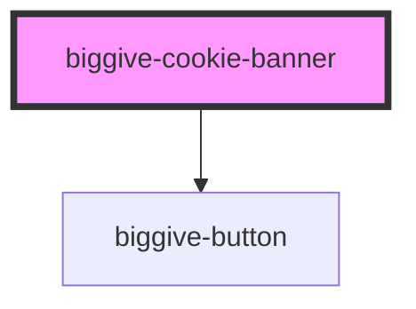

# biggive-cookie-banner

For now this just displays a banner with buttons that do nothing. Once we're happy with how it looks we'll move on
to making it work before we can add it to our website.

<!-- Auto Generated Below -->

## Properties

| Property        | Attribute         | Description | Type     | Default     |
| --------------- | ----------------- | ----------- | -------- | ----------- |
| `blogUriPrefix` | `blog-uri-prefix` |             | `string` | `undefined` |

## Dependencies

### Depends on

- [biggive-button](../biggive-button)

### Graph

----------------------------------------------

*Built with [StencilJS](https://stenciljs.com/)*
