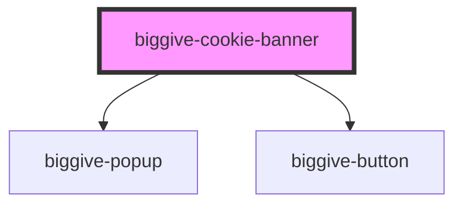

# biggive-cookie-banner

For now this just displays a banner with buttons that do nothing. Once we're happy with how it looks we'll move on
to making it work before we can add it to our website.

<!-- Auto Generated Below -->

## Properties

| Property                     | Attribute         | Description | Type     | Default     |
| ---------------------------- | ----------------- | ----------- | -------- | ----------- |
| `blogUriPrefix` _(required)_ | `blog-uri-prefix` |             | `string` | `undefined` |

## Events

| Event                                 | Description                                                                                                                                                                                         | Type                                                    |
| ------------------------------------- | --------------------------------------------------------------------------------------------------------------------------------------------------------------------------------------------------- | ------------------------------------------------------- |
| `cookieBannerAcceptAllSelected`       | Indicates that the user accepts cookies for any purpose, without discrimination.                                                                                                                    | `CustomEvent<void>`                                     |
| `cookieBannerSavePreferencesSelected` | Indicates that the user has made a selection of cookies purpose to accept.  Event data contains an array of the type of cookie purposes the user consents to, e.g. [] or ['a-and-t', 'third-party'] | `CustomEvent<{ aAndT: Boolean; thirdParty: boolean; }>` |

## Dependencies

### Depends on

- [biggive-popup](../biggive-popup)
- [biggive-button](../biggive-button)

### Graph

----------------------------------------------

*Built with [StencilJS](https://stenciljs.com/)*
