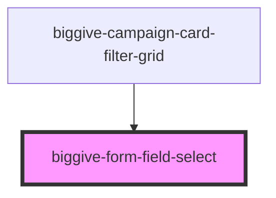

# biggive-form-field-select

<!-- Auto Generated Below -->

## Properties

| Property               | Attribute                | Description                                                                                   | Type                                            | Default      |
| ---------------------- | ------------------------ | --------------------------------------------------------------------------------------------- | ----------------------------------------------- | ------------ |
| `backgroundColour`     | `background-colour`      | Must match background of containing element, or unintended shape will appear.                 | `"grey" \| "white"`                             | `undefined`  |
| `options` _(required)_ | `options`                | JSON array of label+value objects, or takes a stringified equiavalent (for Storybook)         | `string \| { label: string; value: string; }[]` | `undefined`  |
| `placeholder`          | `placeholder`            | Placeholder. If there is no `prompt`, this should be a suitable ARIA label.                   | `string \| undefined`                           | `undefined`  |
| `prompt` _(required)_  | `prompt`                 | Displayed as 'eyebrow' label over the top border of the box.                                  | `null \| string`                                | `undefined`  |
| `selectElementId`      | `select-element-id`      | ID for the select element, used by a label. If not passed then a random id will be generated. | `string \| undefined`                           | `undefined`  |
| `selectStyle`          | `select-style`           |                                                                                               | `"bordered" \| "underlined"`                    | `'bordered'` |
| `selectedLabel`        | `selected-label`         |                                                                                               | `null \| string`                                | `undefined`  |
| `selectedOptionColour` | `selected-option-colour` |                                                                                               | `"blue" \| "inherit"`                           | `'blue'`     |
| `selectedValue`        | `selected-value`         |                                                                                               | `null \| string`                                | `undefined`  |
| `selectionChanged`     | `selection-changed`      |                                                                                               | `(value: string) => void`                       | `undefined`  |
| `spaceBelow`           | `space-below`            | Space below component                                                                         | `number`                                        | `0`          |

## Dependencies

### Used by

 - [biggive-campaign-card-filter-grid](../biggive-campaign-card-filter-grid)

### Graph

----------------------------------------------

*Built with [StencilJS](https://stenciljs.com/)*
