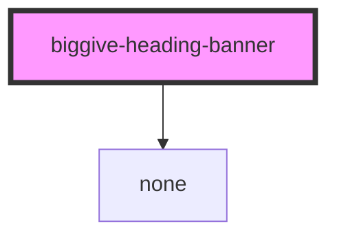

# biggive-heading-banner

A banner component for use as a page header, featuring a background image, optional logo, and text content.

## Usage

```html
<biggive-heading-banner
  main-title="Double the difference"
  teaser="Hi. We're Big Give. Our match funding campaigns offer a unique opportunity for you to double the difference you can make in the world for the causes close to your heart."
  main-image-url="/assets/images/homepage-elephant.jpg"
  background-colour="#F6F6F6"
  focal-point='{"x": 70, "y": 47}'
  text-background-colour="#FF7272"
  text-colour="#000000"
  height="tall"
></biggive-heading-banner>
```

## Properties

| Property              | Attribute               | Description                                                                | Type                                | Default     |
| --------------------- | ----------------------- | -------------------------------------------------------------------------- | ----------------------------------- | ----------- |
| `backgroundColour`    | `background-colour`     | Background color for the banner                                            | `string`                            | `undefined` |
| `focalPoint`          | `focal-point`           | Focal point for the image positioning (x and y values are percentages 0-100) | `{ x: number; y: number }`          | `undefined` |
| `height`              | `height`                | Height variant of the banner ('tall' for full height, 'short' for reduced) | `"short" \| "tall"`                 | `'tall'`    |
| `logo`                | `logo`                  | Optional logo object with URL and alt text                                 | `{ url: string; alt?: string }`     | `undefined` |
| `mainImageUrl`        | `main-image-url`        | URL for the main banner image                                              | `string`                            | `undefined` |
| `mainTitle`           | `main-title`            | Main title text for the banner                                             | `string`                            | `undefined` |
| `slug`                | `slug`                  | Optional slightly smaller text to appear above the main title              | `string`                            | `''`        |
| `teaser`              | `teaser`                | Optional teaser text that appears below the main title                     | `string`                            | `undefined` |
| `textBackgroundColour`| `text-background-colour`| Background color for the text content area                                 | `string`                            | `undefined` |
| `textColour`          | `text-colour`           | Text color for all text content                                            | `string`                            | `undefined` |

## CSS Custom Properties

This component uses Shadow DOM for style encapsulation.

## Dependencies

### Used by

This component is used by:
- Angular heading-banner component in donate-frontend
- WordPress block in biggive theme

### Depends on

- No external dependencies

### Graph


