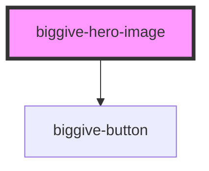

# biggive-hero-image

Provides a large format image-based header feature, typically used at the top of a page. Features an image, title, plus teaser text

<!-- Auto Generated Below -->

## Properties

| Property                   | Attribute                     | Description                                                                                                                                                           | Type                                                                                                                                                                                                                                                                                                                                                                                                                                                                                                      | Default      |
| -------------------------- | ----------------------------- | --------------------------------------------------------------------------------------------------------------------------------------------------------------------- | --------------------------------------------------------------------------------------------------------------------------------------------------------------------------------------------------------------------------------------------------------------------------------------------------------------------------------------------------------------------------------------------------------------------------------------------------------------------------------------------------------- | ------------ |
| `buttonColourScheme`       | `button-colour-scheme`        | Button Colour Scheme                                                                                                                                                  | `"primary" \| "secondary" \| "tertiary" \| "brand-cc-red" \| "brand-wgmf-purple" \| "brand-gmf-green" \| "brand-emf-yellow" \| "brand-c4c-orange" \| "brand-afa-pink" \| "brand-scw-magenta" \| "brand-grey" \| "brand-mhf-turquoise" \| "white" \| "black" \| "grey-extra-light" \| "grey-light" \| "grey-medium" \| "grey-dark" \| "philco-orange" \| "philco-gray-90" \| "philco-gray-70" \| "philco-white" \| "philco-success-green" \| "philco-error-coral" \| "philco-gray-30" \| "philco-gray-20"` | `'primary'`  |
| `buttonLabel`              | `button-label`                | Button Label                                                                                                                                                          | `string`                                                                                                                                                                                                                                                                                                                                                                                                                                                                                                  | `undefined`  |
| `buttonUrl`                | `button-url`                  | Button Url                                                                                                                                                            | `string`                                                                                                                                                                                                                                                                                                                                                                                                                                                                                                  | `undefined`  |
| `colourScheme`             | `colour-scheme`               | Colour Scheme                                                                                                                                                         | `"primary" \| "secondary" \| "tertiary" \| "brand-cc-red" \| "brand-wgmf-purple" \| "brand-gmf-green" \| "brand-emf-yellow" \| "brand-c4c-orange" \| "brand-afa-pink" \| "brand-scw-magenta" \| "brand-grey" \| "brand-mhf-turquoise" \| "white" \| "black" \| "grey-extra-light" \| "grey-light" \| "grey-medium" \| "grey-dark" \| "philco-orange" \| "philco-gray-90" \| "philco-gray-70" \| "philco-white" \| "philco-success-green" \| "philco-error-coral" \| "philco-gray-30" \| "philco-gray-20"` | `'primary'`  |
| `logo`                     | `logo`                        | Full URL of a logo image.                                                                                                                                             | `string`                                                                                                                                                                                                                                                                                                                                                                                                                                                                                                  | `''`         |
| `logoAltText`              | `logo-alt-text`               | Logo alt text                                                                                                                                                         | `string`                                                                                                                                                                                                                                                                                                                                                                                                                                                                                                  | `''`         |
| `logoHeight`               | `logo-height`                 | Logo container height selection. Numbers are not measurements.                                                                                                        | `1 \| 10 \| 2 \| 3 \| 4 \| 5 \| 6 \| 7 \| 8 \| 9`                                                                                                                                                                                                                                                                                                                                                                                                                                                         | `3`          |
| `mainImage`                | `main-image`                  | Full URL of a main hero image.                                                                                                                                        | `null \| string`                                                                                                                                                                                                                                                                                                                                                                                                                                                                                          | `null`       |
| `mainImageAlignHorizontal` | `main-image-align-horizontal` | Horizontal alignment of image                                                                                                                                         | `string`                                                                                                                                                                                                                                                                                                                                                                                                                                                                                                  | `'center'`   |
| `mainImageAlignVertical`   | `main-image-align-vertical`   | Vertical alignment of image                                                                                                                                           | `string`                                                                                                                                                                                                                                                                                                                                                                                                                                                                                                  | `'center'`   |
| `mainImageShape`           | `main-image-shape`            | Determines whether the main image is clipped to a triangle shape (default) or used as a background for the entire component. Clipping can leave a lot of blank space. | `"rectangle" \| "triangle"`                                                                                                                                                                                                                                                                                                                                                                                                                                                                               | `'triangle'` |
| `mainTitle`                | `main-title`                  | Hero image title, typically the page.                                                                                                                                 | `string`                                                                                                                                                                                                                                                                                                                                                                                                                                                                                                  | `undefined`  |
| `mainTitleColour`          | `main-title-colour`           | Main title colour                                                                                                                                                     | `brandColour \| undefined`                                                                                                                                                                                                                                                                                                                                                                                                                                                                                | `undefined`  |
| `slug`                     | `slug`                        | Header slug                                                                                                                                                           | `string`                                                                                                                                                                                                                                                                                                                                                                                                                                                                                                  | `undefined`  |
| `slugColour`               | `slug-colour`                 | Header slug colour                                                                                                                                                    | `"primary" \| "secondary" \| "tertiary" \| "brand-cc-red" \| "brand-wgmf-purple" \| "brand-gmf-green" \| "brand-emf-yellow" \| "brand-c4c-orange" \| "brand-afa-pink" \| "brand-scw-magenta" \| "brand-grey" \| "brand-mhf-turquoise" \| "white" \| "black" \| "grey-extra-light" \| "grey-light" \| "grey-medium" \| "grey-dark" \| "philco-orange" \| "philco-gray-90" \| "philco-gray-70" \| "philco-white" \| "philco-success-green" \| "philco-error-coral" \| "philco-gray-30" \| "philco-gray-20"` | `undefined`  |
| `spaceBelow`               | `space-below`                 | Space below component                                                                                                                                                 | `0 \| 1 \| 2 \| 3 \| 4 \| 5 \| 6`                                                                                                                                                                                                                                                                                                                                                                                                                                                                         | `0`          |
| `teaser`                   | `teaser`                      | Introductory teaser text                                                                                                                                              | `string \| undefined`                                                                                                                                                                                                                                                                                                                                                                                                                                                                                     | `undefined`  |
| `teaserColour`             | `teaser-colour`               | Teaser colour                                                                                                                                                         | `brandColour \| undefined`                                                                                                                                                                                                                                                                                                                                                                                                                                                                                | `undefined`  |

## Dependencies

### Depends on

- [biggive-button](../biggive-button)

### Graph

----------------------------------------------

*Built with [StencilJS](https://stenciljs.com/)*
