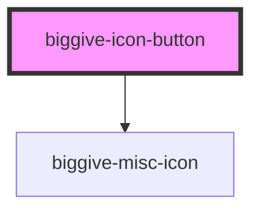

# biggive-icon-button

<!-- Auto Generated Below -->

## Properties

| Property            | Attribute            | Description | Type                                                                                                                                                                                                                                                                                                                                                                                                                                                                                                                                                                                                                                                                                       | Default     |
| ------------------- | -------------------- | ----------- | ------------------------------------------------------------------------------------------------------------------------------------------------------------------------------------------------------------------------------------------------------------------------------------------------------------------------------------------------------------------------------------------------------------------------------------------------------------------------------------------------------------------------------------------------------------------------------------------------------------------------------------------------------------------------------------------ | ----------- |
| `arrow`             | `arrow`              |             | `boolean`                                                                                                                                                                                                                                                                                                                                                                                                                                                                                                                                                                                                                                                                                  | `false`     |
| `arrowColour`       | `arrow-colour`       |             | `"primary" \| "secondary" \| "tertiary" \| "white" \| "black" \| "clear-primary" \| "clear-secondary" \| "clear-tertiary" \| "clear-white" \| "clear-black" \| "brand-cc-red" \| "brand-wgmf-purple" \| "brand-gmf-green" \| "brand-er-green" \| "brand-er-blue" \| "brand-er-teal" \| "brand-er-dark-green" \| "brand-emf-yellow" \| "brand-c4c-orange" \| "brand-afa-pink" \| "brand-scw-magenta" \| "brand-grey" \| "brand-mhf-turquoise" \| "grey-extra-light" \| "grey-light" \| "grey-medium" \| "grey-dark" \| "philco-orange" \| "philco-gray-90" \| "philco-gray-70" \| "philco-white" \| "philco-success-green" \| "philco-error-coral" \| "philco-gray-30" \| "philco-gray-20"` | `'black'`   |
| `backgroundColour`  | `background-colour`  |             | `"primary" \| "secondary" \| "tertiary" \| "white" \| "black" \| "clear-primary" \| "clear-secondary" \| "clear-tertiary" \| "clear-white" \| "clear-black" \| "brand-cc-red" \| "brand-wgmf-purple" \| "brand-gmf-green" \| "brand-er-green" \| "brand-er-blue" \| "brand-er-teal" \| "brand-er-dark-green" \| "brand-emf-yellow" \| "brand-c4c-orange" \| "brand-afa-pink" \| "brand-scw-magenta" \| "brand-grey" \| "brand-mhf-turquoise" \| "grey-extra-light" \| "grey-light" \| "grey-medium" \| "grey-dark" \| "philco-orange" \| "philco-gray-90" \| "philco-gray-70" \| "philco-white" \| "philco-success-green" \| "philco-error-coral" \| "philco-gray-30" \| "philco-gray-20"` | `'white'`   |
| `backgroundPadding` | `background-padding` |             | `0 \| 1 \| 2 \| 3 \| 4 \| 5 \| 6`                                                                                                                                                                                                                                                                                                                                                                                                                                                                                                                                                                                                                                                          | `0`         |
| `buttonId`          | `button-id`          |             | `string \| undefined`                                                                                                                                                                                                                                                                                                                                                                                                                                                                                                                                                                                                                                                                      | `undefined` |
| `centered`          | `centered`           |             | `boolean`                                                                                                                                                                                                                                                                                                                                                                                                                                                                                                                                                                                                                                                                                  | `false`     |
| `circle`            | `circle`             |             | `boolean`                                                                                                                                                                                                                                                                                                                                                                                                                                                                                                                                                                                                                                                                                  | `false`     |
| `icon`              | `icon`               |             | `string`                                                                                                                                                                                                                                                                                                                                                                                                                                                                                                                                                                                                                                                                                   | `undefined` |
| `openInNewTab`      | `open-in-new-tab`    |             | `boolean`                                                                                                                                                                                                                                                                                                                                                                                                                                                                                                                                                                                                                                                                                  | `false`     |
| `rounded`           | `rounded`            |             | `boolean`                                                                                                                                                                                                                                                                                                                                                                                                                                                                                                                                                                                                                                                                                  | `false`     |
| `shadow`            | `shadow`             |             | `boolean`                                                                                                                                                                                                                                                                                                                                                                                                                                                                                                                                                                                                                                                                                  | `false`     |
| `size`              | `size`               |             | `"large" \| "medium" \| "small" \| "x-large" \| "xx-large"`                                                                                                                                                                                                                                                                                                                                                                                                                                                                                                                                                                                                                                | `'medium'`  |
| `spaceBelow`        | `space-below`        |             | `0 \| 1 \| 2 \| 3 \| 4 \| 5 \| 6`                                                                                                                                                                                                                                                                                                                                                                                                                                                                                                                                                                                                                                                          | `1`         |
| `text`              | `text`               |             | `string`                                                                                                                                                                                                                                                                                                                                                                                                                                                                                                                                                                                                                                                                                   | `undefined` |
| `textColour`        | `text-colour`        |             | `"primary" \| "secondary" \| "tertiary" \| "white" \| "black" \| "clear-primary" \| "clear-secondary" \| "clear-tertiary" \| "clear-white" \| "clear-black" \| "brand-cc-red" \| "brand-wgmf-purple" \| "brand-gmf-green" \| "brand-er-green" \| "brand-er-blue" \| "brand-er-teal" \| "brand-er-dark-green" \| "brand-emf-yellow" \| "brand-c4c-orange" \| "brand-afa-pink" \| "brand-scw-magenta" \| "brand-grey" \| "brand-mhf-turquoise" \| "grey-extra-light" \| "grey-light" \| "grey-medium" \| "grey-dark" \| "philco-orange" \| "philco-gray-90" \| "philco-gray-70" \| "philco-white" \| "philco-success-green" \| "philco-error-coral" \| "philco-gray-30" \| "philco-gray-20"` | `'black'`   |
| `url`               | `url`                |             | `string`                                                                                                                                                                                                                                                                                                                                                                                                                                                                                                                                                                                                                                                                                   | `undefined` |

## Events

| Event           | Description | Type                                           |
| --------------- | ----------- | ---------------------------------------------- |
| `doButtonClick` |             | `CustomEvent<{ event: object; url: string; }>` |

## Dependencies

### Depends on

- [biggive-misc-icon](../biggive-misc-icon)

### Graph

----------------------------------------------

*Built with [StencilJS](https://stenciljs.com/)*
