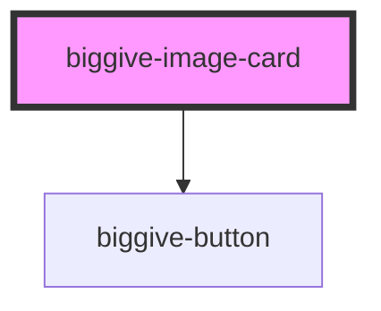

# biggive-basic-card

<!-- Auto Generated Below -->

## Properties

| Property               | Attribute                 | Description | Type                                                                                                                                                                                                                                                                                                                               | Default           |
| ---------------------- | ------------------------- | ----------- | ---------------------------------------------------------------------------------------------------------------------------------------------------------------------------------------------------------------------------------------------------------------------------------------------------------------------------------- | ----------------- |
| `addAnimation`         | `add-animation`           |             | `boolean`                                                                                                                                                                                                                                                                                                                          | `false`           |
| `backgroundColour`     | `background-colour`       |             | `"black" \| "brand-afa-pink" \| "brand-c4c-orange" \| "brand-cc-red" \| "brand-emf-yellow" \| "brand-gmf-green" \| "brand-grey" \| "brand-mhf-turquoise" \| "brand-scw-magenta" \| "brand-wgmf-purple" \| "grey-dark" \| "grey-extra-light" \| "grey-light" \| "grey-medium" \| "primary" \| "secondary" \| "tertiary" \| "white"` | `'primary'`       |
| `buttonAlign`          | `button-align`            |             | `string`                                                                                                                                                                                                                                                                                                                           | `'center'`        |
| `buttonColourScheme`   | `button-colour-scheme`    |             | `string`                                                                                                                                                                                                                                                                                                                           | `'clear-primary'` |
| `buttonLabel`          | `button-label`            |             | `string`                                                                                                                                                                                                                                                                                                                           | `undefined`       |
| `buttonStyle`          | `button-style`            |             | `string`                                                                                                                                                                                                                                                                                                                           | `'standard'`      |
| `buttonUrl`            | `button-url`              |             | `string`                                                                                                                                                                                                                                                                                                                           | `undefined`       |
| `clipBottomLeftCorner` | `clip-bottom-left-corner` |             | `boolean`                                                                                                                                                                                                                                                                                                                          | `true`            |
| `clipTopRightCorner`   | `clip-top-right-corner`   |             | `boolean`                                                                                                                                                                                                                                                                                                                          | `true`            |
| `mainImageAltText`     | `main-image-alt-text`     |             | `string`                                                                                                                                                                                                                                                                                                                           | `undefined`       |
| `mainImageUrl`         | `main-image-url`          |             | `string`                                                                                                                                                                                                                                                                                                                           | `undefined`       |
| `spaceBelow`           | `space-below`             |             | `0 \| 1 \| 2 \| 3 \| 4 \| 5 \| 6`                                                                                                                                                                                                                                                                                                  | `0`               |
| `teaser`               | `teaser`                  |             | `string`                                                                                                                                                                                                                                                                                                                           | `undefined`       |
| `teaserColour`         | `teaser-colour`           |             | `"black" \| "brand-afa-pink" \| "brand-c4c-orange" \| "brand-cc-red" \| "brand-emf-yellow" \| "brand-gmf-green" \| "brand-grey" \| "brand-mhf-turquoise" \| "brand-scw-magenta" \| "brand-wgmf-purple" \| "grey-dark" \| "grey-extra-light" \| "grey-light" \| "grey-medium" \| "primary" \| "secondary" \| "tertiary" \| "white"` | `'black'`         |
| `textAlign`            | `text-align`              |             | `"center" \| "left" \| "right"`                                                                                                                                                                                                                                                                                                    | `'center'`        |

## Dependencies

### Depends on

- [biggive-button](../biggive-button)

### Graph

----------------------------------------------

*Built with [StencilJS](https://stenciljs.com/)*
