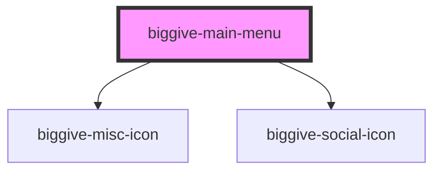

# biggive-main-menu

<!-- Auto Generated Below -->

## Properties

| Property                          | Attribute                              | Description                                                                                                                                                                                                                                                                                                                                                                                                                                                                   | Type      | Default                           |
| --------------------------------- | -------------------------------------- | ----------------------------------------------------------------------------------------------------------------------------------------------------------------------------------------------------------------------------------------------------------------------------------------------------------------------------------------------------------------------------------------------------------------------------------------------------------------------------- | --------- | --------------------------------- |
| `blogUrlPrefix`                   | `blog-url-prefix`                      |                                                                                                                                                                                                                                                                                                                                                                                                                                                                               | `string`  | `'https://biggive.org'`           |
| `donateUrlPrefix`                 | `donate-url-prefix`                    |                                                                                                                                                                                                                                                                                                                                                                                                                                                                               | `string`  | `'https://donate.biggive.org'`    |
| `experienceUrlPrefix`             | `experience-url-prefix`                |                                                                                                                                                                                                                                                                                                                                                                                                                                                                               | `string`  | `'https://community.biggive.org'` |
| `isLoggedIn`                      | `is-logged-in`                         | Whether the current user is logged in (i.e. is assumed to have a valid JWT). They get links to some extra content if they are.                                                                                                                                                                                                                                                                                                                                                | `boolean` | `false`                           |
| `myAccountFlagEnabled`            | `my-account-flag-enabled`              |                                                                                                                                                                                                                                                                                                                                                                                                                                                                               | `boolean` | `false`                           |
| `someCampaignHasHomePageRedirect` | `some-campaign-has-home-page-redirect` | We don't want to make the ?noredirect version proliferate too much so err on not including this. We also don't really want every single page to have to get highlight cards to set this property. So for now, typically only meta-campaign bothers to get the correct value to set this true if appropriate. That's the page which is the destination of the redirect so is arguably the only place where it's essential that the menu lets you go to the 'normal' home page. | `boolean` | `false`                           |

## Events

| Event           | Description | Type                |
| --------------- | ----------- | ------------------- |
| `logoutClicked` |             | `CustomEvent<void>` |

## Methods

### `closeMobileMenuFromOutside() => Promise<void>`

#### Returns

Type: `Promise<void>`

## Dependencies

### Depends on

- [biggive-misc-icon](../biggive-misc-icon)
- [biggive-social-icon](../biggive-social-icon)

### Graph

----------------------------------------------

*Built with [StencilJS](https://stenciljs.com/)*
