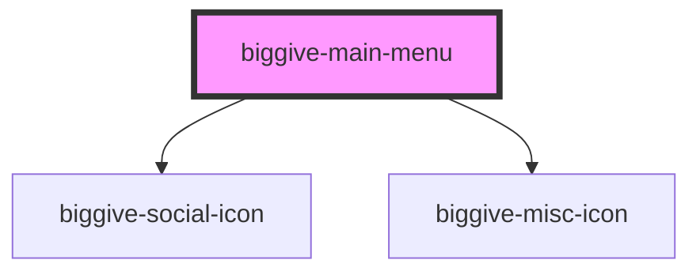

# biggive-main-menu

<!-- Auto Generated Below -->

## Properties

| Property              | Attribute               | Description                                                                                                                    | Type      | Default     |
| --------------------- | ----------------------- | ------------------------------------------------------------------------------------------------------------------------------ | --------- | ----------- |
| `blogUrlPrefix`       | `blog-url-prefix`       |                                                                                                                                | `string`  | `undefined` |
| `donateUrlPrefix`     | `donate-url-prefix`     | E.g. "https://donate.biggive.org" for production (currently)                                                                   | `string`  | `undefined` |
| `experienceUrlPrefix` | `experience-url-prefix` |                                                                                                                                | `string`  | `undefined` |
| `isLoggedIn`          | `is-logged-in`          | Whether the current user is logged in (i.e. is assumed to have a valid JWT). They get links to some extra content if they are. | `boolean` | `false`     |

## Methods

### `closeMobileMenuFromOutside() => Promise<void>`

#### Returns

Type: `Promise<void>`

## Dependencies

### Depends on

- [biggive-social-icon](../biggive-social-icon)
- [biggive-misc-icon](../biggive-misc-icon)

### Graph

----------------------------------------------

*Built with [StencilJS](https://stenciljs.com/)*
