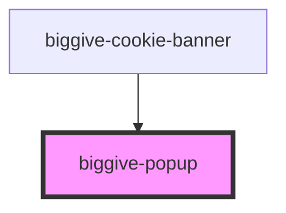

# biggive-popup

<!-- Auto Generated Below -->

## Properties

| Property              | Attribute | Description                                                                            | Type         | Default    |
| --------------------- | --------- | -------------------------------------------------------------------------------------- | ------------ | ---------- |
| `modalClosedCallback` | --        | Function to execute when the modal is closed, whether by the user or programmatically. | `() => void` | `() => {}` |

## Methods

### `closeFromOutside() => Promise<void>`

#### Returns

Type: `Promise<void>`

### `openFromOutside() => Promise<void>`

#### Returns

Type: `Promise<void>`

## Dependencies

### Used by

 - [biggive-cookie-banner](../biggive-cookie-banner)

### Graph

----------------------------------------------

*Built with [StencilJS](https://stenciljs.com/)*
