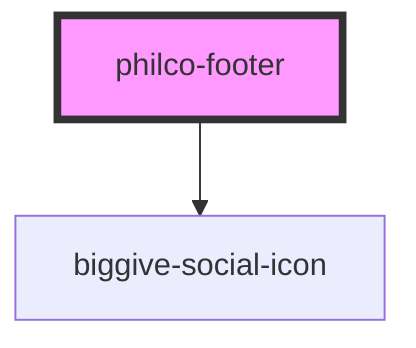

# biggive-footer

<!-- Auto Generated Below -->

## Properties

| Property                  | Attribute                    | Description                                                                                                                 | Type                         | Default     |
| ------------------------- | ---------------------------- | --------------------------------------------------------------------------------------------------------------------------- | ---------------------------- | ----------- |
| `blogUrlPrefix`           | `blog-url-prefix`            |                                                                                                                             | `string \| undefined`        | `'http://'` |
| `donateUrlPrefix`         | `donate-url-prefix`          | URL prefixes vary by environment, and components library is not best placed to know what they are, so we take them as props | `string`                     | `'http://'` |
| `experienceUrlPrefix`     | `experience-url-prefix`      |                                                                                                                             | `string \| undefined`        | `'http://'` |
| `headingLevel`            | `heading-level`              |                                                                                                                             | `1 \| 2 \| 3 \| 4 \| 5 \| 6` | `5`         |
| `smallCharityWeekEnabled` | `small-charity-week-enabled` |                                                                                                                             | `boolean`                    | `false`     |

## Dependencies

### Depends on

- [biggive-social-icon](../biggive-social-icon)

### Graph

----------------------------------------------

*Built with [StencilJS](https://stenciljs.com/)*
