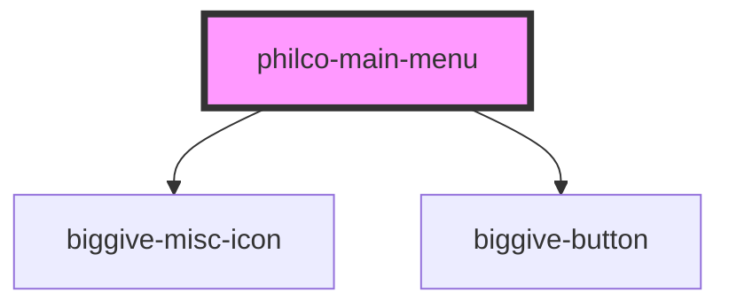

# biggive-main-menu

<!-- Auto Generated Below -->

## Properties

| Property          | Attribute           | Description | Type     | Default     |
| ----------------- | ------------------- | ----------- | -------- | ----------- |
| `philcoUrlPrefix` | `philco-url-prefix` |             | `string` | `undefined` |

## Events

| Event           | Description | Type                |
| --------------- | ----------- | ------------------- |
| `logoutClicked` |             | `CustomEvent<void>` |

## Methods

### `closeMobileMenuFromOutside() => Promise<void>`

#### Returns

Type: `Promise<void>`

## Dependencies

### Depends on

- [biggive-misc-icon](../biggive-misc-icon)
- [biggive-button](../biggive-button)

### Graph

----------------------------------------------

*Built with [StencilJS](https://stenciljs.com/)*
